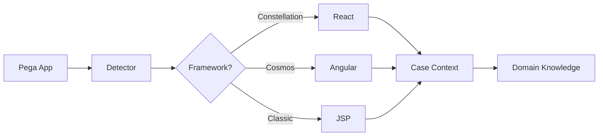
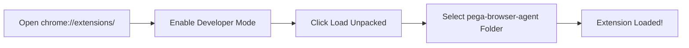
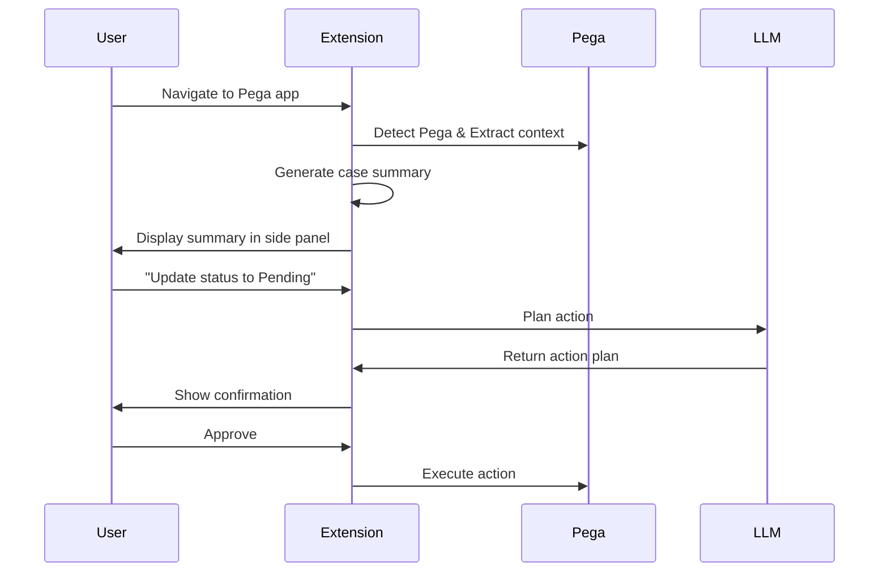
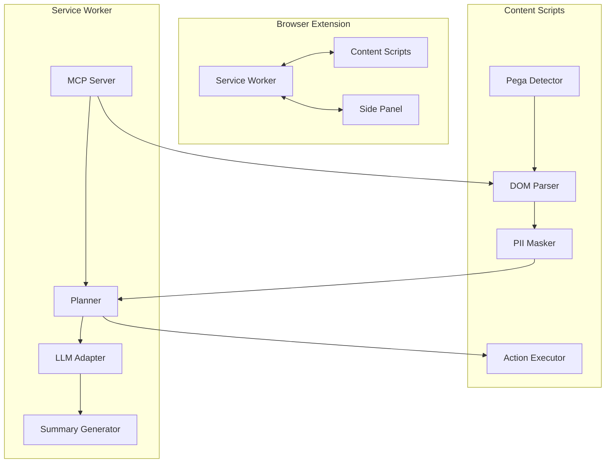
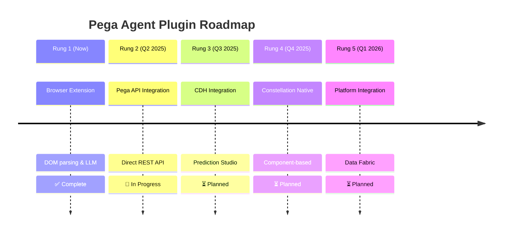
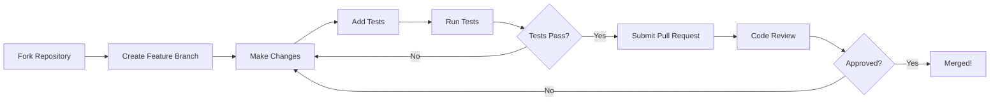
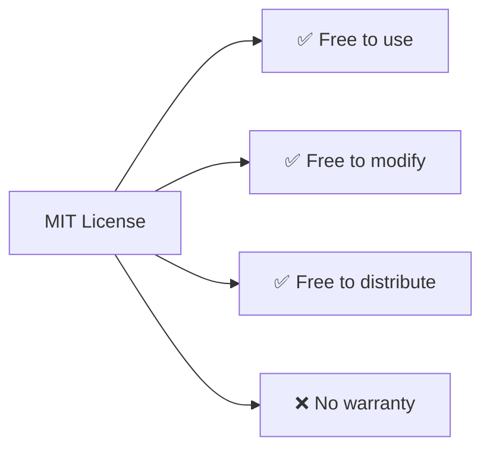

<div align="center">

  

  # 🤖 Pega Agent Plugin

  ### **Third-party AI-powered browser extension for Pega Infinity case workers**

  [](https://github.com/skc-learn/pega-agent-plugin/releases)
  [](LICENSE)
  [](https://github.com/skc-learn/pega-agent-plugin/graphs/contributors)
  [](https://github.com/skc-learn/pega-agent-plugin/stargazers)

  [](https://www.typescriptlang.org/)
  [](https://developer.chrome.com/docs/extensions/mv3/)
  [](https://www.anthropic.com/)

  **⚠️ Disclaimer**: This is NOT an official Pegasystems product. It's an independent open-source community project.

</div>

---

## 📋 Table of Contents

- [✨ Features](#-features)
- [🚀 Quick Start](#-quick-start)
- [📚 Documentation](#-documentation)
- [🏗️ Architecture](#️-architecture)
- [⚙️ Configuration](#️-configuration)
- [🧪 Development](#-development)
- [🗺️ Roadmap](#️-roadmap)
- [🤝 Contributing](#-contributing)
- [📄 License](#-license)

---

## ✨ Features

<div align="center">

### 🎯 Core Capabilities

| Feature | Description | Status |
|---------|-------------|--------|
| 🧠 **Pega-Aware Intelligence** | Auto-detects Pega apps, extracts case context, understands domain | ✅ Stable |
| 🔒 **Privacy-First PII Protection** | 8 categories, field-level masking, tokenization before transmission | ✅ Stable |
| 💬 **Natural Language Commands** | 11 supported intents, local & AI-powered | ✅ Stable |
| 📊 **Case Summarization** | Auto-generated 4-part summaries with risk signals | ✅ Stable |
| 🎯 **Action Planning** | 14 action types with smart waiting & confirmation | ✅ Stable |
| 👁️ **Visual Understanding** | Screenshot capture & visual analysis | ✅ Stable |
| 🔄 **Workflow Automation** | Multi-step workflows with self-healing | ✅ Stable |
| 🔌 **MCP Server** | Full Model Context Protocol implementation | ✅ Stable |

</div>

---

### 🎭 Playwright & Stagehand-Inspired Features

<div align="center">

**Advanced browser automation with self-healing capabilities**

</div>

Inspired by industry-leading tools like **Playwright** and **Stagehand**, the extension includes powerful headless browser automation features:

#### 🎯 Smart Waiting Strategies

Unlike traditional scripts that use fixed delays, we use intelligent waiting:

| Strategy | Use Case | Example |
|----------|----------|---------|
| `WAIT_FOR_ELEMENT` | Wait for element to exist | Wait for submit button to appear |
| `WAIT_FOR_VISIBLE` | Wait for element to be visible | Wait for modal to fade in |
| `WAIT_FOR_ENABLED` | Wait for element to be clickable | Wait for disabled input to become enabled |
| `WAIT_FOR_HIDDEN` | Wait for element to disappear | Wait for loading spinner to vanish |
| `WAIT_FOR_TEXT` | Wait for text content | Wait for "Success" message |

**Benefits:**
- ⚡ **Faster execution** - No arbitrary delays
- 🔄 **More reliable** - Waits exactly as long as needed
- 🛡️ **Flakiness resistant** - Adapts to network conditions

#### 🔍 Self-Healing Selectors

When an action fails, the system automatically tries alternative strategies:

```mermaid
graph TD
    A[Action Fails] --> B{Try Alternative}
    B --> C[Test ID Selector}
    B --> D[Test Data Attribute}
    B --> E[ARIA Label]
    B --> F[Text Content}
    B --> G[CSS Selector}
    C --> H{Success?}
    D --> H
    E --> H
    F --> H
    G --> H
    H -->|Yes| I[Continue]
    H -->|No| J[Retry with Fallback]
```

**Fallback Hierarchy:**
1. **Test ID** - `data-test-id="submit-btn"`
2. **Data Attribute** - `data-pega-action="submit"`
3. **ARIA Label** - `aria-label="Submit case"`
4. **Text Content** - Button text matches
5. **CSS Selector** - Structural selector
6. **Visual Position** - Element coordinates (via screenshot analysis)

#### 📸 Screenshot-Based Visual Validation

Capture and analyze screenshots to verify action results:

```javascript
// Example: Verify form submission
await executeAction('CLICK', { selector: '#submit-btn' });
await executeAction('WAIT_FOR_HIDDEN', { selector: '#loading-spinner' });
await takeScreenshot();
await executeAction('VERIFY_VISIBLE', { selector: '.success-message' });
```

**Visual Capabilities:**
- 📸 **Screenshot capture** - Full page or element-specific
- 🔍 **Visual analysis** - Detect elements by appearance
- ⚖️ **Visual diffing** - Compare before/after states
- 🎯 **Element detection** - Find elements without selectors

#### 🔄 Multi-Step Workflow Orchestration

Complex workflows with state management and conditional logic:

```yaml
workflow:
  name: "Loan Application Intake"
  steps:
    - action: NAVIGATE
      url: "/cases/create/loan"
    - action: TYPE
      selector: "#applicant-name"
      value: "{NAME_1}"  # PII token
    - action: SELECT
      selector: "#loan-type"
      value: "Mortgage"
    - action: CONDITION
      condition: "amount > 100000"
      then: ESCALATE
      else: SAVE
```

**Workflow Features:**
- 📝 **Declarative syntax** - YAML-based workflow definitions
- 🔄 **Loops** - Batch process multiple cases
- 🔀 **Conditionals** - If/then/else logic
- ⏸️ **Pause/Resume** - Control execution
- 📊 **State persistence** - Share data between steps
- 🔧 **Error recovery** - Automatic retries with fallback

#### 🎭 Action Execution Engine

Execute complex actions with built-in intelligence:

```javascript
// Example: Smart form fill
await executeAction('TYPE', {
  selector: '#status',
  value: 'Pending Documentation',
  waitFor: 'enabled',        // Wait for input to be enabled
  validate: true,             // Verify value was set
  screenshotAfter: true       // Take screenshot after action
});
```

**Action Options:**
- ⏱️ **Smart waiting** - Automatic wait conditions
- ✔️ **Validation** - Verify action succeeded
- 📸 **Screenshots** - Capture before/after
- 🔄 **Retry** - Automatic retry with fallback
- 📝 **Logging** - Complete audit trail

#### 🧪 Visual Regression Testing

Detect UI changes automatically:

| Feature | Description |
|---------|-------------|
| **Baseline Capture** | Store screenshots as baseline |
| **Visual Diff** | Compare current vs baseline |
| **Change Detection** | Highlight differences |
| **Regression Alert** | Flag unexpected changes |

---

### 🧠 Pega-Aware Intelligence



**Capabilities:**
- 🎯 **Automatic Detection** - Recognizes Pega by domain, UI patterns, DOM structure
- 🖼️ **Framework Support** - Constellation (React), Cosmos (Angular), Classic UI
- 🏦 **Domain Knowledge** - Financial Lending, Insurance Claims, Healthcare, Service Management
- 📋 **Case Context** - Extracts ID, type, status, stage, assignee, urgency automatically

---

### 🔒 Privacy & Security First

| PII Category | Pattern Examples | Mask Format |
|--------------|------------------|-------------|
| **NAME** | First Name, Last Name, Full Name | `{NAME_1}` |
| **SSN** | Social Security, Tax ID, EIN | `{SSN_1}` |
| **DOB** | Date of Birth, Birth Date | `{DOB_1}` |
| **EMAIL** | Email, E-Mail Address | `{EMAIL_1}` |
| **PHONE** | Phone, Mobile, Cell, Telephone | `{PHONE_1}` |
| **ACCOUNT** | Account Number, Card Number, Policy # | `{ACCOUNT_1}` |
| **ADDRESS** | Address, Street, City, State, ZIP | `{ADDRESS_1}` |
| **INCOME** | Income, Salary, Annual Income | `{INCOME_1}` |

**Security Guarantees:**
- ✅ Field-level masking before ANY external transmission
- ✅ Session-scoped token isolation
- ✅ Complete audit trail with masked tokens only
- ✅ Never accesses Pega authentication tokens
- ✅ Local-first processing with user control

---

### 💬 Natural Language Commands

<details>
<summary><b>Local Intents (No LLM Required)</b></summary>

| Command | Action | Confidence |
|---------|--------|------------|
| `Summarize this case` | Generate 4-part case summary | 95% |
| `Submit/Complete` | Submit case (requires confirmation) | 90% |
| `Save` | Persist changes | 95% |
| `Next` | Proceed to next step | 92% |
| `My queue` | Show assigned cases | 88% |

</details>

<details>
<summary><b>AI-Powered Intents</b></summary>

| Command | Action | Requires |
|---------|--------|----------|
| `Update the status to [value]` | Field updates | LLM |
| `Escalate to supervisor` | Transfer case | LLM |
| `Create a new case` | Start new case | LLM |
| `Open case ABC-123` | Navigate to case | LLM |
| `Find cases with...` | Search & filter | LLM |
| `Explain why...` | Get explanations | LLM |

</details>

---

### 📊 Case Summarization

**Auto-generated 4-part summaries when cases open:**

```markdown
## Situation
Brief description of what the case is about and why it was created.

## History
- 2025-03-01: Case created
- 2025-03-05: Initial review completed
- 2025-03-07: Documentation requested

## Current State
Status: Pending Documentation
Stage: Processing
Assignee: John Doe
Urgency: High

## Risk Signals
⚠️ SLA at risk (3 days remaining)
⚠️ Required field missing: .Description
⚠️ No updates in 48 hours
```

---

### 🎯 Action Planning & Execution

**14 Action Types:**
- `CLICK` - Click buttons, links, checkboxes
- `TYPE` - Enter text in input fields
- `SELECT` - Choose dropdown options
- `CLEAR` - Clear field values
- `NAVIGATE` - Navigate to URLs
- `WAIT_FOR_ELEMENT` - Wait until element exists
- `WAIT_FOR_VISIBLE` - Wait until element is visible
- `WAIT_FOR_ENABLED` - Wait until element is enabled
- `WAIT_FOR_HIDDEN` - Wait until element is hidden
- `WAIT_FOR_TEXT` - Wait for text to appear
- `VERIFY_VISIBLE` - Confirm element is visible
- `ASSERT_TEXT` - Validate text content
- `SCROLL` - Scroll page or element
- `WAIT` - Fixed time delay (use sparingly)

---

### 🔌 MCP Server

**Model Context Protocol for external integrations:**

| Tool | Description |
|------|-------------|
| `pega_get_case_summary` | Generate case summary |
| `pega_execute_action_plan` | Execute action plan |
| `pega_get_dom_snapshot` | Get current DOM state |
| `pega_detect_framework` | Detect Pega framework |
| `pega_update_field` | Update field value |
| `pega_click_action` | Click action button |
| `pega_navigate_case` | Navigate to case |
| `pega_wait_for` | Smart wait condition |

**Resources:**
- `case_context` - Current case information
- `dom_snapshot` - Current DOM state
- `case_summary` - Generated case summary
- `audit_log` - Action audit trail

---

## 🚀 Quick Start

### Prerequisites

- **Node.js** 18+ 
- **Chrome/Edge** (Manifest V3 support)
- **LLM API Key** (Anthropic, OpenAI, or Azure)

### Installation

```bash
# Clone the repository
git clone https://github.com/skc-learn/pega-agent-plugin.git
cd pega-agent-plugin/pega-browser-agent

# Install dependencies
npm install

# Build the extension
npm run build
```

### Load in Chrome

<div align="center">



</div>

**Steps:**
1. Navigate to `chrome://extensions/`
2. Toggle **Developer mode** (top right)
3. Click **Load unpacked**
4. Select the `pega-browser-agent` folder

### Configure API Key

```javascript
// Via browser console
chrome.storage.session.set({ 'llm-api-key': 'your-api-key' });

// Or via extension settings
chrome://extensions/ → Pega Agent Plugin → Details → Extension settings
```

### Usage

<div align="center">



</div>

1. Navigate to any Pega Infinity application
2. Click the extension icon or press `Ctrl+Shift+P`
3. Use natural language commands in the side panel

---

## 📚 Documentation

| Document | Description | Link |
|----------|-------------|------|
| 🏗️ **Architecture** | System design, components, data flow | [View](docs/architecture.md) |
| 📖 **API Reference** | Complete API documentation | [View](docs/api.md) |
| 👨‍💻 **Developer Guide** | Setup, development, testing | [View](docs/DEVELOPER_GUIDE.md) |
| 🔒 **Security** | Security model, PII protection, compliance | [View](docs/SECURITY.md) |
| 🗺️ **Roadmap** | 5-rung integration ladder | [View](docs/ROADMAP.md) |
| 💡 **Usage Examples** | Practical examples & troubleshooting | [View](docs/USAGE_EXAMPLES.md) |

---

## 🏗️ Architecture

<div align="center">



</div>

**Component Overview:**

| Component | Responsibility |
|-----------|----------------|
| **Service Worker** | Central message router, orchestrator, LLM adapter |
| **Content Scripts** | DOM interaction, PII masking, action execution |
| **Side Panel** | Chat-style UI controller |
| **PII Masker** | Field classification & tokenization |
| **DOM Parser** | Semantic DOM extraction |
| **Planner** | Intent-to-action transformation |
| **MCP Server** | External integration protocol |

---

## ⚙️ Configuration

### Default Configuration

```json
{
  "security": {
    "piiMaskingEnabled": true,
    "piiCategoriesToMask": [
      "NAME", "SSN", "DOB", "EMAIL", 
      "PHONE", "ACCOUNT", "ADDRESS", "INCOME"
    ],
    "auditLoggingEnabled": true
  },
  "llm": {
    "provider": "anthropic",
    "model": "claude-sonnet-4-20250514",
    "maxTokens": 1500,
    "temperature": 0.1
  },
  "pega": {
    "autoDetect": true,
    "allowedDomains": ["*.pegacloud.io", "*.pega.com"]
  },
  "roleRestrictions": {
    "caseWorker": [
      "SUMMARIZE_CASE", "UPDATE_FIELD", 
      "NEXT_STEP", "SAVE_CASE", "SHOW_QUEUE"
    ],
    "supervisor": ["*"],
    "readOnly": [
      "SUMMARIZE_CASE", "SHOW_QUEUE", "EXPLAIN"
    ]
  }
}
```

### Multi-LLM Configuration

```json
{
  "llm": {
    "provider": "multi",
    "providers": [
      {
        "name": "anthropic",
        "apiKey": "sk-ant-...",
        "models": ["claude-sonnet-4-20250514"]
      },
      {
        "name": "azure-openai",
        "endpoint": "https://your-resource.openai.azure.com/",
        "apiKey": "your-key",
        "models": ["gpt-4"]
      }
    ],
    "fallback": true
  }
}
```

---

## 🧪 Development

### Development Workflow

```bash
# Clone the repository
git clone https://github.com/skc-learn/pega-agent-plugin.git
cd pega-agent-plugin/pega-browser-agent

# Install dependencies
npm install

# Development mode with hot reload
npm run dev

# Run tests
npm test

# Type checking
npm run type-check

# Linting
npm run lint

# Build for production
npm run build

# Package for distribution
npm run package
```

### Project Structure

```
pega-browser-agent/
├── src/
│   ├── content-scripts/     # DOM interaction
│   │   ├── pega-detector.ts
│   │   ├── dom-parser.ts
│   │   ├── pii-masker.ts
│   │   └── action-executor.ts
│   ├── service-worker/      # Background processing
│   │   ├── sw.ts
│   │   ├── planner.ts
│   │   ├── llm-adapter.ts
│   │   └── mcp-server.ts
│   ├── side-panel/          # UI panel
│   │   └── panel.ts
│   ├── shared/              # Common utilities
│   │   ├── types.ts
│   │   ├── message-types.ts
│   │   └── pega-heuristics.ts
│   └── config/              # Configuration
│       └── default-config.ts
├── tests/                   # Unit tests
│   ├── unit/
│   └── fixtures/
├── public/                  # HTML/CSS assets
├── manifest.json            # Extension manifest
├── package.json
├── tsconfig.json
└── webpack.config.cjs
```

### Testing

```bash
# Run all tests
npm test

# Run tests in watch mode
npm test -- --watch

# Run tests with coverage
npm test -- --coverage

# Run specific test file
npm test -- pii-masker.test.ts
```

**Test Coverage:**
- ✅ PII Masker: 8 categories × 100+ test cases
- ✅ Intent Classifier: 11 intents × positive/negative examples
- ✅ Session isolation tests
- ✅ Token resolution tests

---

## 🗺️ Roadmap

<div align="center">



</div>

**5-Rung Integration Ladder:**

| Rung | Capability | Status | Timeline |
|------|------------|--------|----------|
| **1** | Browser Extension with DOM parsing | ✅ Complete | Now |
| **2** | Direct Pega API integration | 🔄 Beta | Q2 2025 |
| **3** | CDH and Prediction Studio | ⏳ Alpha | Q3 2025 |
| **4** | Constellation-native component | ⏳ Design | Q4 2025 |
| **5** | Platform Rules & Data Fabric | ⏳ Research | Q1 2026 |

---

## 🤝 Contributing

We welcome contributions! Here's how to get started:

<div align="center">



</div>

### Contribution Guidelines

1. 🍴 **Fork** the repository
2. 🔀 **Create** a feature branch (`git checkout -b feature/amazing-feature`)
3. 💾 **Commit** your changes (`git commit -m 'Add amazing feature'`)
4. 📤 **Push** to the branch (`git push origin feature/amazing-feature`)
5. 🔃 **Open** a Pull Request

### Code Style

- **TypeScript** with strict typing (no `any` types)
- **CamelCase** for variables and functions
- **PascalCase** for classes and interfaces
- **kebab-case** for file names
- **JSDoc** comments for all public APIs

### Pull Request Checklist

- [ ] Tests added/updated
- [ ] All tests passing
- [ ] Documentation updated
- [ ] Code follows style guidelines
- [ ] Commit messages are clear
- [ ] No merge conflicts

---

## 📄 License

<div align="center">



</div>

**MIT License** - See [LICENSE](LICENSE) file for details.

This project is free to use, modify, and distribute. No warranty is provided.

---

## ⚠️ Disclaimer

<div align="center">

### This is NOT an official Pegasystems product

</div>

This project is:
- ❌ **NOT** affiliated with Pegasystems Inc.
- ❌ **NOT** endorsed by Pegasystems Inc.
- ❌ **NOT** sponsored by Pegasystems Inc.
- ❌ **NOT** supported by Pegasystems Inc.

### Trademark Notice

**Pega®**, **Pega Infinity®**, **Pega Infinity '23**, **Pega PLATFORM®**, **Pega Cosmos®**, **Pega Constellation®**, and all related marks are trademarks of **Pegasystems Inc.**

These trademarks are used only for descriptive purposes to indicate compatibility with Pega applications.

### Use at Your Own Risk

- ✅ Test thoroughly in non-production environments
- ✅ Ensure compliance with your organization's security policies
- ✅ Review code and configuration before production use
- ❌ Authors are NOT liable for any damage to data or systems

---

## 📞 Support

<div align="center">

### Need Help?

</div>

| Resource | Link |
|----------|------|
| **Issues** | [GitHub Issues](https://github.com/skc-learn/pega-agent-plugin/issues) |
| **Discussions** | [GitHub Discussions](https://github.com/skc-learn/pega-agent-plugin/discussions) |
| **Documentation** | [Full Docs](https://github.com/skc-learn/pega-agent-plugin/tree/main/docs) |
| **Pega Support** | [Pega Community](https://community.pega.com/) |

---

<div align="center">

## ⭐ Star Us on GitHub!

If you find this project helpful, please consider giving it a star ⭐

[](https://github.com/skc-learn/pega-agent-plugin/stargazers)

---

### Built with ❤️ by the Pega Community

> This project is an independent community effort and is not officially affiliated with Pegasystems Inc.

[🏠 Back to Home](https://github.com/skc-learn/pega-agent-plugin)
•
[📖 Documentation](https://github.com/skc-learn/pega-agent-plugin/tree/main/docs)
•
[🐛 Report Issue](https://github.com/skc-learn/pega-agent-plugin/issues)
•
[💡 Feature Request](https://github.com/skc-learn/pega-agent-plugin/issues/new?template=feature_request.md)

</div>
