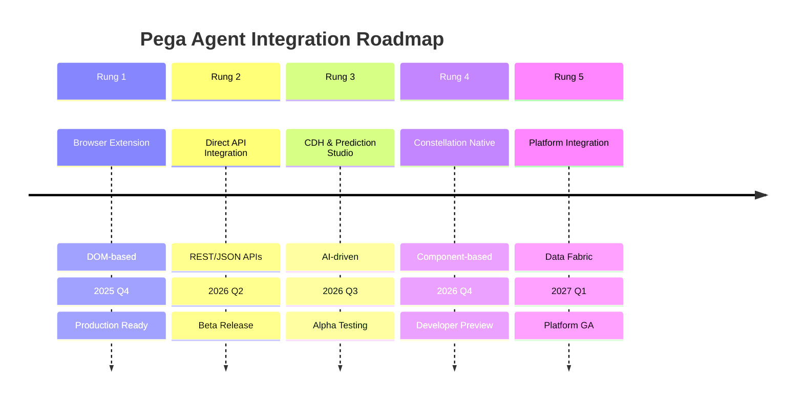
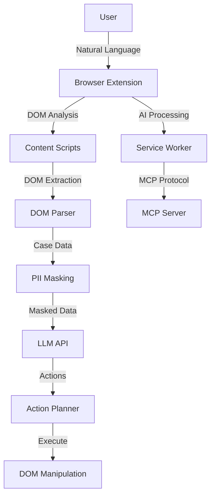
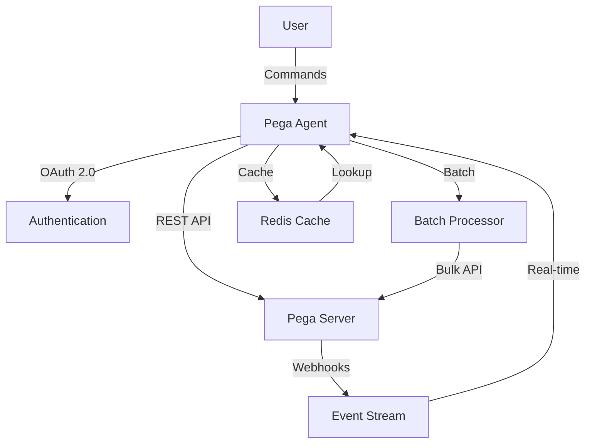
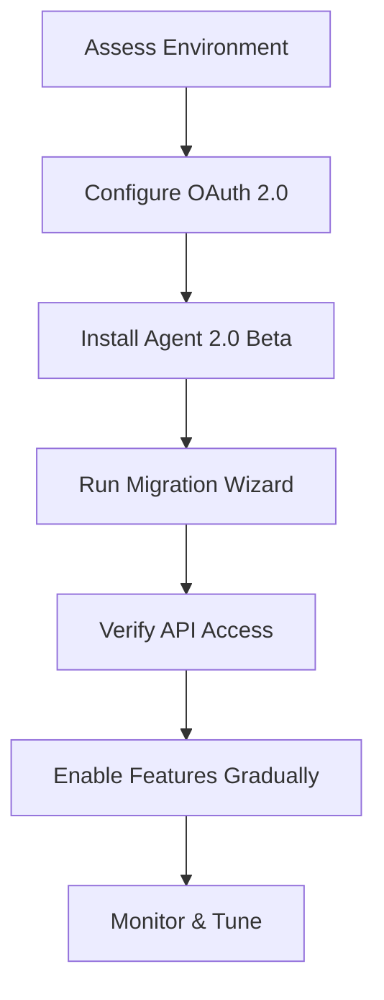
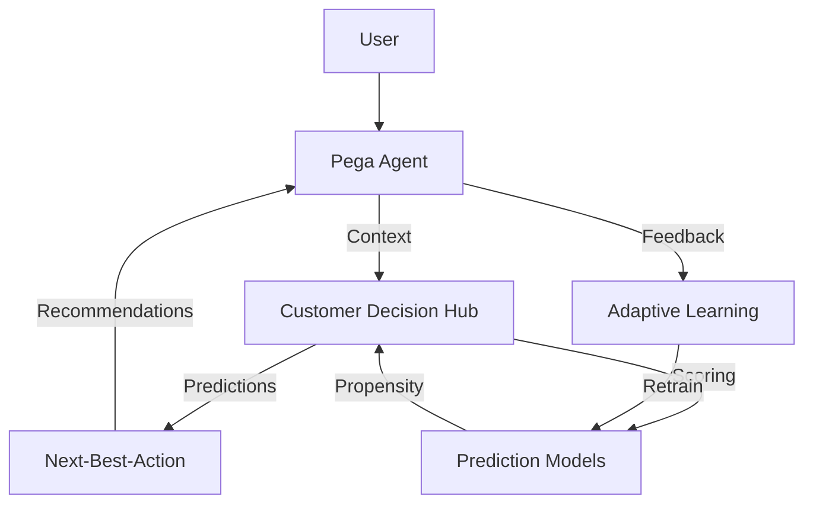
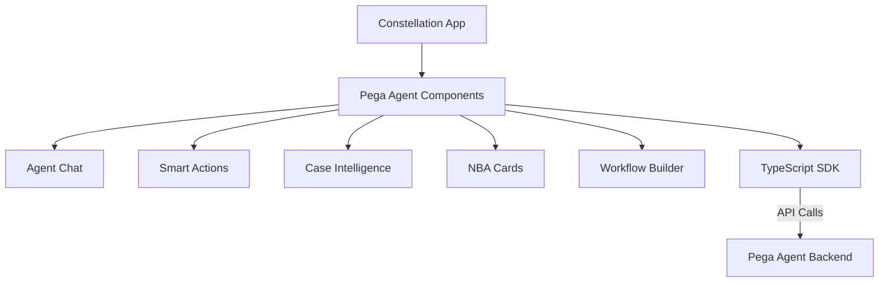
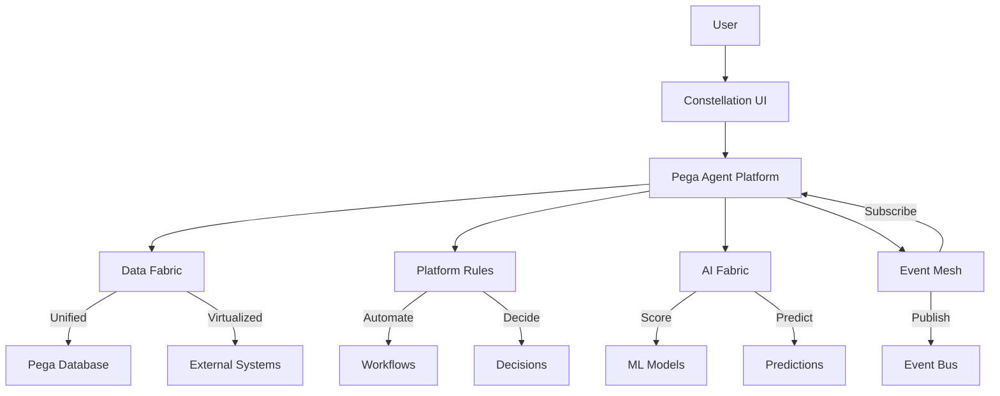
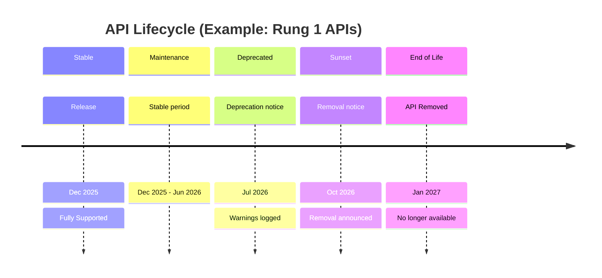
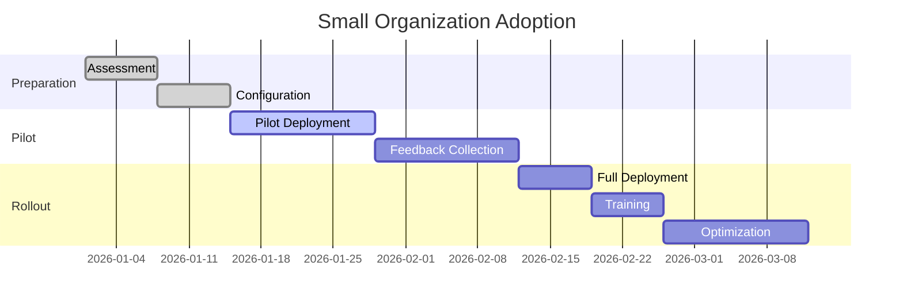
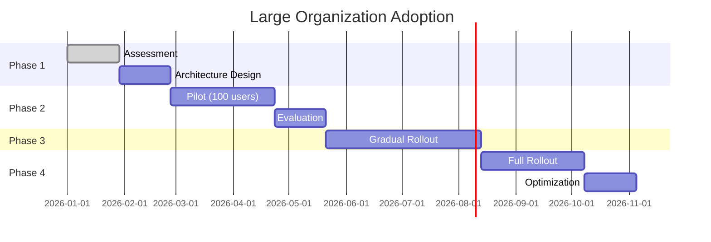

# Pega Agent - Migration & Roadmap

## Overview

The Pega Agent follows a **5-Rung Integration Ladder**, evolving from a browser extension to a fully integrated platform solution. Each rung represents increasing integration depth, capability, and performance.

**Current Status**: Rung 1 (Browser Extension) - Production Ready  
**Next Milestone**: Rung 2 (Direct API Integration) - Beta Q2 2026

---

## 5-Rung Integration Ladder



### Integration Depth Comparison

| Rung | Integration Type | Performance | Capability | Migration Effort |
|------|------------------|-------------|------------|------------------|
| **1** | Browser Extension | ⭐⭐ | ⭐⭐ | N/A (Starting Point) |
| **2** | Direct API | ⭐⭐⭐ | ⭐⭐⭐ | Medium |
| **3** | CDH Integration | ⭐⭐⭐⭐ | ⭐⭐⭐⭐ | High |
| **4** | Constellation Native | ⭐⭐⭐⭐⭐ | ⭐⭐⭐⭐ | High |
| **5** | Platform | ⭐⭐⭐⭐⭐ | ⭐⭐⭐⭐⭐ | Very High |

---

## Rung 1: Browser Extension (Current)

### Status
- **Release**: Production Ready (December 2025)
- **Version**: 1.x
- **Support**: Full Enterprise Support

### Capabilities

#### Core Features
- ✅ **Automatic Pega Detection** via domain, UI patterns, DOM structure
- ✅ **Framework Support**: Constellation (React), Cosmos (Angular), Classic UI
- ✅ **Natural Language Commands**: 11 supported intents
- ✅ **Case Summarization**: 4-part AI-generated summaries
- ✅ **Action Planning**: 14 action types with confirmation
- ✅ **PII Protection**: 8 categories with field-level masking
- ✅ **Multi-LLM Support**: Anthropic, Azure OpenAI, OpenAI, Local
- ✅ **MCP Server**: Full Model Context Protocol implementation

#### Supported Intents

**Local (No LLM Required)**:
- `Summarize this case` - Generate 4-part case summary
- `Submit/Complete` - Submit case (requires confirmation)
- `Save` - Persist changes
- `Next` - Proceed to next step
- `My queue` - Show assigned cases

**AI-Powered**:
- `Update the status to [value]` - Field updates
- `Escalate to supervisor` - Transfer case
- `Create a new case` - Start new case
- `Open case ABC-123` - Navigate to case
- `Find cases with...` - Search
- `Explain why...` - Get explanations

### Architecture



### Limitations

#### Technical Constraints
- **DOM Dependency**: Relies on DOM structure and CSS selectors
- **Performance**: 2-5 second latency for AI commands
- **Fragility**: UI changes can break selectors
- **No Real-time Updates**: Polling-based state detection
- **Limited Context**: Cannot access server-side state
- **Browser Bound**: Requires browser environment

#### Feature Limitations
- No direct access to Pega database
- No integration with Prediction Studio
- Limited to case worker role
- No support for batch operations
- No offline capability

### Use Cases

**Ideal For**:
- Individual case workers
- Proof of concept deployments
- Organizations with browser-based workflows
- Quick deployment scenarios

**Not Ideal For**:
- High-volume batch processing
- Real-time decisioning requirements
- Custom application integration
- Server-side automation

### Known Issues

| Issue | Severity | Workaround | Fix Version |
|-------|----------|------------|-------------|
| Cosmos React selector fragility | Medium | Manual selector configuration | 1.2 |
| Limited Classic UI support | Low | Use Constellation UI | 2.0 |
| Multi-tab state synchronization | Low | Single tab usage | 1.3 |
| Large case performance | Medium | Pagination for summaries | 1.4 |

---

## Rung 2: Direct Pega API Integration

### Status
- **Planned Release**: Beta Q2 2026
- **Version**: 2.0.0-beta
- **Support**: Limited Beta Support

### Vision

Replace DOM parsing with direct REST API integration for:

- **Reliability**: Eliminate DOM dependency
- **Performance**: 50-70% latency reduction
- **Capabilities**: Access server-side state
- **Scalability**: Support batch operations
- **Context**: Full case history and metadata

### Planned Capabilities

#### New Features
- 🚀 **REST API Integration**: Direct Pega REST APIs
- 🚀 **Real-time Updates**: Webhook-based event streaming
- 🚀 **Batch Operations**: Process multiple cases
- 🚀 **Server-Side Context**: Access to all case data
- 🚀 **Enhanced Security**: OAuth 2.0 integration
- 🚀 **Offline Queue**: Queue actions for sync

#### Enhanced Existing Features
- ⚡ **Faster Commands**: 500ms-1s latency (vs 2-5s)
- ⚡ **Richer Summaries**: Access complete case history
- ⚡ **Better Actions**: Direct API calls instead of DOM
- ⚡ **Accurate Detection**: API-based case identification

### Architecture



### Migration Path

#### Upgrade Requirements

**Prerequisites**:
1. Pega Infinity '23+ with REST APIs enabled
2. OAuth 2.0 client credentials
3. API access permissions for service account
4. Network connectivity to Pega server

**Migration Steps**:



#### Breaking Changes

| Area | Rung 1 (DOM) | Rung 2 (API) | Migration Impact |
|------|--------------|--------------|------------------|
| Authentication | None required | OAuth 2.0 | ⚠️ Configuration required |
| Command Format | Natural language | Same + API parameters | ✅ Backward compatible |
| Action Execution | DOM manipulation | REST API calls | ⚠️ Custom actions need update |
| Data Access | DOM only | Full case data | ✅ Enhanced, no breaking |
| Performance | 2-5s latency | 500ms-1s | ✅ Improvement |

#### Backward Compatibility

- ✅ **Natural Language Commands**: Same syntax
- ✅ **PII Masking**: Same protection levels
- ✅ **LLM Integration**: Same providers
- ⚠️ **Custom Actions**: May need adaptation
- ⚠️ **Configuration**: New API settings required

### Beta Timeline

| Milestone | Date | Description |
|-----------|------|-------------|
| Alpha Release | April 2026 | Internal testing |
| Beta 1 | June 2026 | Limited beta (10 customers) |
| Beta 2 | August 2026 | Public beta |
| RC1 | October 2026 | Release candidate |
| GA | November 2026 | General availability |

---

## Rung 3: CDH & Prediction Studio Integration

### Status
- **Planned Release**: Alpha Q3 2026
- **Version**: 3.0.0-alpha
- **Support**: Early Access Program

### Vision

Integrate with Pega Customer Decision Hub for AI-driven decisioning:

- **Predictive Intelligence**: Next-best-action recommendations
- **Real-time Scoring**: Customer propensity models
- **Adaptive Learning**: Continuous model improvement
- **Decision Analytics**: Explainable AI insights

### New Capabilities

#### Prediction Studio Integration
- 🎯 **Next-Best-Action**: AI-recommended actions
- 🎯 **Propensity Scoring**: Customer likelihood models
- 🎯 **Churn Prediction**: At-risk identification
- 🎯 **Sentiment Analysis**: Customer mood detection
- 🎯 **Lifetime Value**: Customer scoring

#### CDH Features
- 📊 **Real-time Decisions**: Sub-second decisioning
- 📊 **Context-Aware**: Full customer context
- 📊 **Multi-channel**: Consistent across channels
- 📊 **A/B Testing**: Built-in experimentation
- 📊 **Model Governance**: MLOps integration

### Architecture



### Use Cases

1. **Customer Service**
   - Predict churn risk
   - Recommend retention offers
   - Suggest next actions

2. **Sales**
   - Identify cross-sell opportunities
   - Prioritize leads
   - Optimize contact timing

3. **Collections**
   - Predict payment probability
   - Suggest treatment strategies
   - Optimize contact channels

### Migration Considerations

#### Prerequisites
- CDH license and installation
- Prediction Studio configured
- Historical data for models
- Data science team involvement

#### Data Requirements
- Minimum 6 months historical data
- Customer interaction history
- Case outcomes and resolutions
- Feature engineering pipeline

---

## Rung 4: Constellation Native

### Status
- **Planned Release**: Developer Preview Q4 2026
- **Version**: 4.0.0-preview
- **Support**: Developer Preview Support

### Vision

Native Constellation components for tight Pega integration:

- **Component-Based**: Reusable UI components
- **Performance**: Sub-100ms response times
- **Developer Experience**: TypeScript-first development
- **Customization**: Extensible component architecture

### New Capabilities

#### Native Components
- 🔧 **Agent Chat Component**: Embedded chat UI
- 🔧 **Smart Action Bar**: Context-aware actions
- 🔧 **Case Intelligence Panel**: Real-time insights
- 🔧 **Prediction Cards**: NBA recommendations
- 🔧 **Workflow Builder**: Visual workflow designer

#### Developer Experience
- 🛠️ **TypeScript SDK**: Full type safety
- 🛠️ **Component Library**: Reusable components
- 🛠️ **CLI Tools**: Code generation & scaffolding
- 🛠️ **Testing Framework**: Unit and integration tests
- 🛠️ **DevTools Plugin**: Debugging and inspection

### Architecture



### Performance Improvements

| Metric | Rung 3 | Rung 4 | Improvement |
|--------|--------|--------|-------------|
| Command Latency | 500ms-1s | 50-100ms | 10x faster |
| Component Load | 1-2s | 100-200ms | 10x faster |
| Memory Usage | 150MB | 50MB | 3x reduction |
| Bundle Size | 2MB | 500KB | 4x smaller |

### Developer Experience

#### Before (Rung 1-3)
```javascript
// Browser extension approach
chrome.runtime.sendMessage({
  action: 'executeCommand',
  command: 'Summarize case'
});
```

#### After (Rung 4)
```typescript
// Native component approach
import { usePegaAgent } from '@pega/agent-constellation';

function CasePanel() {
  const { summarize, loading } = usePegaAgent();
  
  return (
    <Button onClick={() => summarize()} loading={loading}>
      Summarize
    </Button>
  );
}
```

---

## Rung 5: Platform Integration

### Status
- **Planned Release**: GA Q1 2027
- **Version**: 5.0.0
- **Support**: Full Platform Support

### Vision

Complete platform integration with Pega Infinity:

- **Data Fabric**: Unified data access
- **Platform Rules**: Decision automation
- **Event Mesh**: Real-time event processing
- **AI Fabric**: Enterprise AI integration

### Ultimate Capabilities

#### Data Fabric Integration
- 🌐 **Unified Data**: Single source of truth
- 🌐 **Data Virtualization**: Cross-system access
- 🌐 **Real-time Sync**: Event-driven updates
- 🌐 **Data Governance**: Centralized policies

#### Platform Rules
- 📋 **Declarative Rules**: No-code automation
- 📋 **Decision Tables**: Business logic
- 📋 **Event Processing**: Complex event processing
- 📋 **Workflow Orchestration**: Multi-system workflows

#### AI Fabric
- 🤖 **Model Management**: MLOps integration
- 🤖 **Feature Store**: Reusable features
- 🤖 **Experiment Tracking**: A/B testing
- 🤖 **Model Governance**: Compliance and audit

### Architecture



### Platform Features

#### 1. Data Integration
- Unified data access layer
- Real-time data synchronization
- Cross-system queries
- Data lineage and governance

#### 2. Decision Automation
- Declarative rule engine
- Decision trees and tables
- Complex event processing
- Workflow orchestration

#### 3. AI/ML Integration
- Model lifecycle management
- Feature engineering
- Experiment tracking
- Model governance

#### 4. Event-Driven Architecture
- Real-time event streaming
- Event sourcing
- CQRS pattern
- Event replay

---

## Migration Guides

### Upgrading Between Rungs

#### Rung 1 → Rung 2 Migration

**Phase 1: Preparation (1-2 weeks)**
```bash
# 1. Assess environment
npx @pega/agent-cli assess --from rung1 --to rung2

# 2. Check prerequisites
npx @pega/agent-cli check-prerequisites

# 3. Backup configuration
npx @pega/agent-cli backup --include config,credentials
```

**Phase 2: Configuration (1 week)**
```bash
# 1. Configure OAuth 2.0
npx @pega/agent-cli config oauth --client-id YOUR_ID

# 2. Test API connectivity
npx @pega/agent-cli test-api --endpoint rest/cases

# 3. Import existing settings
npx @pega/agent-cli import --from rung1
```

**Phase 3: Deployment (1-2 days)**
```bash
# 1. Install new version
npm install @pega/agent@2.0.0-beta

# 2. Run migration wizard
npx @pega/agent-cli migrate --wizard

# 3. Verify functionality
npx @pega/agent-cli verify --smoke-test
```

**Phase 4: Rollout (1-2 weeks)**
- Pilot with 5-10 users
- Monitor metrics and logs
- Gather feedback
- Full rollout

#### Rung 2 → Rung 3 Migration

**Additional Requirements**:
1. CDH installation and configuration
2. Prediction Studio setup
3. Model training (6-8 weeks)
4. Data pipeline setup

**Migration Steps**:
```bash
# 1. Install CDH integration
npm install @pega/agent-cdh@3.0.0-alpha

# 2. Configure models
npx @pega/agent-cli configure-cdh --models churn,nba

# 3. Train models
npx @pega/agent-cli train-models --historical-data 6months

# 4. Enable features
npx @pega/agent-cli enable-feature prediction-studio
```

#### Rung 3 → Rung 4 Migration

**Development Workflow**:
```bash
# 1. Install SDK
npm install @pega/agent-constellation@4.0.0-preview

# 2. Generate components
npx @pega/agent-cli generate-component AgentChat

# 3. Build custom components
npm run build:components

# 4. Deploy to Pega
npx @pega/agent-cli deploy --platform constellation
```

#### Rung 4 → Rung 5 Migration

**Platform Integration**:
```bash
# 1. Install platform package
npm install @pega/agent-platform@5.0.0

# 2. Configure Data Fabric
npx @pega/agent-cli configure-data-fabric --sources pega,external

# 3. Setup Platform Rules
npx @pega/agent-cli setup-rules --import rules/

# 4. Enable AI Fabric
npx @pega/agent-cli enable-ai-fabric --models all
```

### Backward Compatibility

#### API Compatibility Matrix

| Version | Rung 1 API | Rung 2 API | Rung 3 API | Rung 4 API | Rung 5 API |
|---------|------------|------------|------------|------------|------------|
| **1.x** | ✅ | ❌ | ❌ | ❌ | ❌ |
| **2.x** | ✅ | ✅ | ❌ | ❌ | ❌ |
| **3.x** | ⚠️ | ✅ | ✅ | ❌ | ❌ |
| **4.x** | ❌ | ⚠️ | ✅ | ✅ | ❌ |
| **5.x** | ❌ | ❌ | ⚠️ | ✅ | ✅ |

✅ = Full Support  
⚠️ = Deprecated  
❌ = Not Supported

#### Deprecation Policy

**Deprecation Timeline**:
- **Announcement**: 6 months before removal
- **Warning Period**: 3 months with logged warnings
- **Removal**: After 6 months

**Example**:
```
v1.x APIs: Deprecated Jan 2026, Removed Jul 2026
v2.x APIs: Deprecated Jul 2026, Removed Jan 2027
```

### Data Migration

#### Configuration Migration

**Automatic Migration**:
```bash
# Auto-migrate configuration
npx @pega/agent-cli migrate-config --from 1.x --to 2.x
```

**Manual Overrides**:
```json
// config/overrides.json
{
  "llm": {
    "provider": "anthropic",  // Keep existing
    "model": "claude-sonnet-4-20250514"  // Update model
  },
  "features": {
    "rung2": {
      "apiIntegration": true,  // Enable new
      "domFallback": false  // Disable old
    }
  }
}
```

#### Data Schema Changes

**Rung 1 → Rung 2**:
```typescript
// Old schema
interface CaseDataV1 {
  id: string;
  type: string;
  status: string;
}

// New schema
interface CaseDataV2 extends CaseDataV1 {
  // Extended fields
  history: CaseEvent[];
  assignments: Assignment[];
  sla: SLAInformation;
  metadata: CaseMetadata;
}
```

**Migration Script**:
```bash
# Migrate cached data
npx @pega/agent-cli migrate-data --schema v2 --output ./migrated
```

---

## Future Enhancements

### Planned Features

#### Q2 2026 (Rung 2 Beta)
- [ ] Multi-language support (Spanish, German, French)
- [ ] Voice command integration
- [ ] Mobile browser support
- [ ] Advanced analytics dashboard
- [ ] Custom action templates

#### Q3 2026 (Rung 3 Alpha)
- [ ] A/B testing framework
- [ ] Custom model training
- [ ] Model explainability
- [ ] Real-time decision metrics
- [ ] Experiment tracking

#### Q4 2026 (Rung 4 Preview)
- [ ] Component marketplace
- [ ] Visual workflow builder
- [ ] Low-code automation
- [ ] Advanced debugging tools
- [ ] Performance profiler

#### Q1 2027 (Rung 5 GA)
- [ ] Cross-platform workflows
- [ ] Advanced event processing
- [ ] Data virtualization
- [ ] AI model governance
- [ ] Enterprise SSO integration

### Community Requests

#### Most Requested Features

1. **Offline Mode** (89 votes)
   - Queue actions when offline
   - Sync when connectivity restored
   - Planned: Rung 2

2. **Custom Actions** (76 votes)
   - User-defined action templates
   - JavaScript/TypeScript extensions
   - Planned: Rung 4

3. **Multi-tenant Support** (64 votes)
   - Isolate data per tenant
   - Tenant-specific configurations
   - Planned: Rung 5

4. **Advanced Analytics** (58 votes)
   - Usage metrics and insights
   - Performance dashboards
   - Planned: Rung 2

5. **Integration Hub** (52 votes)
   - Connect to external systems
   - Webhook support
   - Planned: Rung 5

### Technology Evolution

#### AI/ML Advancements
- **GPT-5 Integration**: Multi-modal capabilities
- **Local LLM Support**: Privacy-preserving local models
- **Federated Learning**: Collaborative model training
- **Explainable AI**: Transparent decision-making

#### Platform Improvements
- **Edge Computing**: Distributed processing
- **GraphQL Support**: Flexible data queries
- **Real-time Sync**: WebSocket-based updates
- **Microservices Architecture**: Modular components

#### Security Enhancements
- **Zero Trust Architecture**: Advanced security model
- **Hardware Security Modules**: Key management
- **Blockchain Audit Trail**: Immutable logs
- **Homomorphic Encryption**: Privacy-preserving computation

---

## API Evolution

### Versioning Strategy

#### Semantic Versioning

**Format**: `MAJOR.MINOR.PATCH`

- **MAJOR**: Breaking changes (rung upgrades)
- **MINOR**: New features (backward compatible)
- **PATCH**: Bug fixes (backward compatible)

**Examples**:
- `1.0.0` → `1.1.0`: New features, compatible
- `1.1.0` → `2.0.0`: Breaking changes, migration required
- `2.0.0` → `2.0.1`: Bug fix, compatible

#### Rung-Based Versioning

| Version | Rung | Release Type | Support |
|---------|------|--------------|---------|
| `1.x.x` | Rung 1 | Browser Extension | Until Jul 2026 |
| `2.x.x` | Rung 2 | API Integration | Until Jan 2027 |
| `3.x.x` | Rung 3 | CDH Integration | Until Jul 2027 |
| `4.x.x` | Rung 4 | Constellation Native | Until Jan 2028 |
| `5.x.x` | Rung 5 | Platform | Ongoing |

### Deprecation Timeline

#### API Lifecycle



#### Deprecation Policy

**Timeline**:
1. **Announcement**: 6 months before deprecation
2. **Warning Period**: 3 months with logged warnings
3. **Migration Support**: Documentation and tools provided
4. **Removal**: After 6 months

**Example**:
```
January 2026: "DOM-based actions will be deprecated in July 2026"
April 2026: "DOM-based actions deprecated, please migrate to API actions"
July 2026: "DOM-based actions sunset, will be removed in January 2027"
January 2027: "DOM-based actions removed"
```

### Breaking Change Policy

#### What Constitutes a Breaking Change?

**Major Breaking Changes**:
- API endpoint changes
- Data structure modifications
- Required parameter additions
- Authentication changes
- Removal of features

**Minor Breaking Changes**:
- Optional parameter additions
- Response field additions
- Error code updates
- Logging format changes

#### Communication Process

1. **6 Months Before**: Announcement in release notes
2. **3 Months Before**: Detailed migration guide
3. **1 Month Before**: Final reminder
4. **Release**: Breaking change released

#### Migration Support

**Tools Provided**:
- Automated migration scripts
- Compatibility checkers
- Migration wizards
- Code samples

**Documentation**:
- Migration guides
- API comparisons
- Best practices
- Troubleshooting

---

## Adoption Strategy

### Planning Your Adoption

#### Assessment Checklist

**Current State**:
- [ ] Pega Infinity version ('23+)
- [ ] UI framework (Constellation/Cosmos/Classic)
- [ ] Current browser extension usage
- [ ] API access and permissions
- [ ] Security and compliance requirements

**Technical Readiness**:
- [ ] OAuth 2.0 infrastructure
- [ ] Network connectivity
- [ ] LLM API access (Anthropic/Azure/OpenAI)
- [ ] Development team capacity
- [ ] Testing environment

**Business Readiness**:
- [ ] Executive sponsorship
- [ ] Budget allocation
- [ ] User training plan
- [ ] Change management process
- [ ] Success metrics defined

#### Timeline Planning

**Small Organization (<100 users)**:


**Large Organization (>1000 users)**:


### Risk Mitigation

#### Common Risks

| Risk | Impact | Probability | Mitigation |
|------|--------|-------------|------------|
| UI changes break selectors | High | Medium | Use API-based approach (Rung 2+) |
| LLM API rate limits | Medium | Low | Implement caching and queuing |
| PII data exposure | Critical | Low | Multi-layer PII masking |
| User adoption resistance | Medium | Medium | Training and change management |
| Performance degradation | High | Low | Load testing and optimization |

#### Rollback Strategy

**Immediate Rollback (<1 hour)**:
```bash
# Revert to previous version
npx @pega/agent-cli rollback --version 1.x.x

# Restore configuration
npx @pega/agent-cli restore --backup latest
```

**Graceful Degradation**:
- Fall back to DOM parsing if API unavailable
- Queue actions for later processing
- Read-only mode for critical issues

---

## Support & Resources

### Getting Help

**Documentation**:
- [Installation Guide](./INSTALLATION.md)
- [API Reference](./API.md)
- [Troubleshooting](./TROUBLESHOOTING.md)
- [Best Practices](./BEST_PRACTICES.md)

**Community**:
- GitHub Issues: https://github.com/skc-learn/pega-agent-plugin/issues
- Discussions: https://github.com/skc-learn/pega-agent-plugin/discussions
- Stack Overflow: Tag with `pega-agent`

**Enterprise Support**:
- Email: pega-agent-support@pega.com
- SLA: 24-hour response for critical issues
- Dedicated support for premium customers

### Training & Certification

**Available Courses**:
1. **Pega Agent Fundamentals** (2 hours)
   - Installation and configuration
   - Basic command usage
   - Troubleshooting

2. **Advanced Pega Agent** (4 hours)
   - Custom action development
   - Integration patterns
   - Performance optimization

3. **Pega Agent Administration** (6 hours)
   - Enterprise deployment
   - Security and compliance
   - Monitoring and metrics

**Certification**:
- Pega Agent Certified Professional
- Pega Agent Certified Developer
- Pega Agent Certified Administrator

### Contributing

**How to Contribute**:
1. Fork the repository
2. Create a feature branch
3. Make your changes with tests
4. Ensure all tests pass
5. Submit a pull request

**Contribution Areas**:
- Bug fixes
- Feature requests
- Documentation improvements
- Test cases
- Performance optimizations

---

## Appendix

### Glossary

- **CDH**: Customer Decision Hub
- **NBA**: Next-Best-Action
- **PII**: Personally Identifiable Information
- **MCP**: Model Context Protocol
- **LLM**: Large Language Model
- **OAuth**: Open Authorization
- **REST**: Representational State Transfer
- **API**: Application Programming Interface
- **SLA**: Service Level Agreement
- **MLOps**: Machine Learning Operations

### References

**Pega Documentation**:
- [Pega Infinity Documentation](https://www.pega.com/documentation)
- [Constellation Guide](https://www.pega.com/constellation)
- [CDH Documentation](https://www.pega.com/customer-decision-hub)

**External Resources**:
- [Anthropic Claude API](https://docs.anthropic.com)
- [Azure OpenAI Service](https://azure.microsoft.com/en-us/services/cognitive-services/openai-service/)
- [OpenAI API](https://platform.openai.com/docs)

### Version History

| Version | Date | Rung | Changes |
|---------|------|------|---------|
| 1.0.0 | Dec 2025 | Rung 1 | Initial release |
| 1.1.0 | Jan 2026 | Rung 1 | Multi-language support |
| 1.2.0 | Feb 2026 | Rung 1 | Performance improvements |
| 2.0.0-beta | Jun 2026 | Rung 2 | API integration beta |
| 2.0.0 | Nov 2026 | Rung 2 | API integration GA |
| 3.0.0-alpha | Sep 2026 | Rung 3 | CDH integration alpha |
| 4.0.0-preview | Dec 2026 | Rung 4 | Constellation native preview |
| 5.0.0 | Mar 2027 | Rung 5 | Platform integration GA |

---

**Document Version**: 1.0.0  
**Last Updated**: May 10, 2026  
**Next Review**: June 2026

**Maintained By**: Pega Agent Team  
**Feedback**: pega-agent-feedback@pega.com

---

*This roadmap is forward-looking and subject to change. Dates and features are estimates and may be adjusted based on technical requirements, customer feedback, and market conditions.*
