# Pega Browser Agent - Architecture Documentation

## Table of Contents

1. [System Architecture](#system-architecture)
2. [Core Components](#core-components)
3. [Message Passing Protocol](#message-passing-protocol)
4. [Security Architecture](#security-architecture)
5. [State Management](#state-management)
6. [MCP Server](#mcp-server)
7. [Technology Choices](#technology-choices)

---

## System Architecture

### High-Level Component Diagram

```mermaid
graph TB
    subgraph "Browser Extension"
        SW[Service Worker]
        SP[Side Panel]
        CS[Content Scripts]
        
        subgraph "Content Script Modules"
            PD[Pega Detector]
            DO[DOM Observer]
            DP[DOM Parser]
            PM[PII Masker]
            AE[Action Executor]
        end
        
        subgraph "Service Worker Modules"
            PL[Planner]
            LA[LLM Adapter]
            SG[Summary Generator]
            SS[Session Store]
            AL[Audit Logger]
            MS[MCP Server]
            MC[MCP Client]
            WO[Workflow Orchestrator]
            CS2[Case State Manager]
            VU[Visual Understanding]
        end
    end
    
    subgraph "External Systems"
        LLM[LLM Providers]
        MCP[MCP Servers]
        Pega[Pega Infinity Application]
    end
    
    SP <-->|User Commands| SW
    CS <-->|DOM Snapshots| SW
    CS <-->|Action Execution| Pega
    SW <-->|API Calls| LLM
    SW <-->|MCP Protocol| MCP
    
    CS -->|Detection| PD
    CS -->|Observation| DO
    CS -->|Parsing| DP
    CS -->|PII Masking| PM
    CS -->|Execution| AE
    
    SW -->|Planning| PL
    SW -->|LLM Calls| LA
    SW -->|Summarization| SG
    SW -->|State| SS
    SW -->|Audit| AL
    SW -->|MCP Server| MS
    SW -->|MCP Client| MC
    SW -->|Workflows| WO
    SW -->|Case State| CS2
    SW -->|Vision| VU
    
    style SW fill:#e1f5ff
    style SP fill:#fff4e1
    style CS fill:#e8f5e9
    style Pega fill:#fce4ec
```

### Extension Architecture (Manifest V3)

The extension follows Chrome's Manifest V3 architecture:

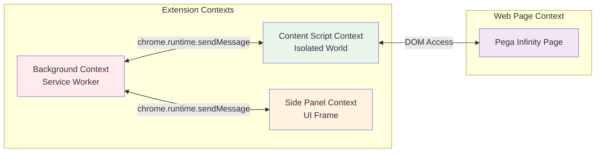

**Key Isolation Characteristics:**

- **Service Worker**: Single background instance, no DOM access, persistent state
- **Content Scripts**: Isolated JavaScript world per tab, full DOM access
- **Side Panel**: UI context for user interaction, no direct DOM access to page
- **Trust Boundaries**: Service worker is the ONLY trusted component for external communication

### Component Interaction Patterns

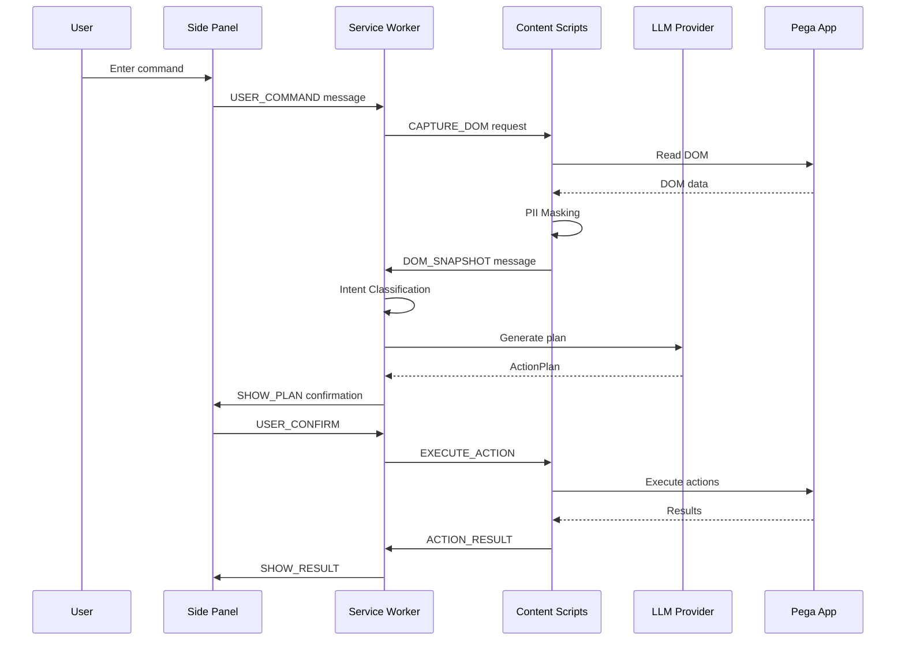

### Data Flow Between Components

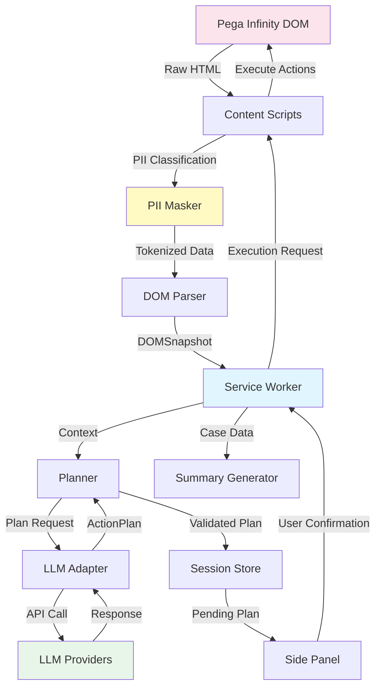

---

## Core Components

### Service Worker (sw.ts)

**Purpose**: Central message router and orchestrator for all extension components.

**Responsibilities:**
- Initialize and configure all subsystems (LLM, MCP, session store, audit logger)
- Handle all inter-component message routing
- Orchestrate plan generation and execution
- Manage Pega detection lifecycle
- Coordinate summary generation
- Handle MCP server and client connections

**Key Methods:**
```typescript
class ServiceWorker {
  async initialize(): Promise<void>
  async handleMessage(message: Message, sender: chrome.runtime.MessageSender): Promise<boolean>
  private async handleUserCommand(payload: UserCommandPayload): Promise<void>
  private async handleDomSnapshot(payload: DomSnapshotPayload): Promise<void>
  private async handleActionResult(payload: ActionResultPayload): Promise<void>
  private async executePlan(tabId: number, actionPlan: ActionPlan): Promise<void>
}
```

**Lifecycle Management:**
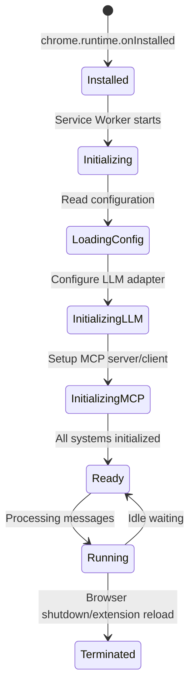

### Planner (planner.ts)

**Purpose**: Transform natural language commands + Pega context into executable action plans.

**Design Philosophy:**
- **Local First**: Handle high-confidence intents without LLM (SUBMIT, SAVE, NEXT)
- **LLM Fallback**: Use LLM for complex or ambiguous intents
- **Domain-Aware**: Inject Pega-specific patterns and domain knowledge

**Intent Classification Flow:**
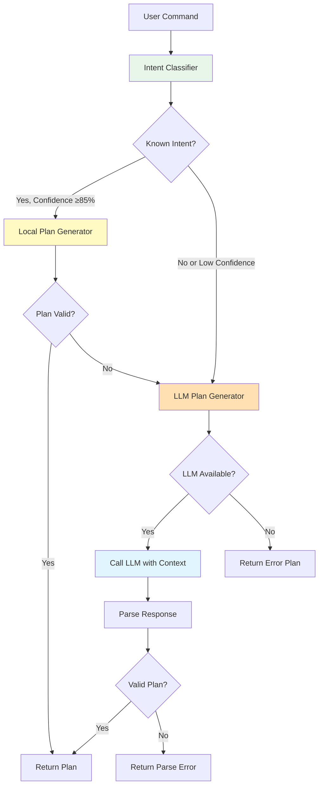

**Plan Generation Examples:**

1. **Local Plan** (SUBMIT_CASE):
```json
{
  "planId": "uuid",
  "intent": "SUBMIT_CASE",
  "summary": "Submit case LOAN-123",
  "requiresConfirmation": true,
  "steps": [
    {
      "stepNumber": 1,
      "action": "CLICK",
      "selector": "[data-test-id=\"SubmitButton\"]",
      "description": "Click Submit button",
      "isReversible": false
    },
    {
      "stepNumber": 2,
      "action": "WAIT",
      "selector": "",
      "value": "2000",
      "description": "Wait for case submission to complete",
      "isReversible": true
    }
  ],
  "expectedOutcome": "Case submitted successfully"
}
```

2. **LLM Plan** (complex update):
```json
{
  "planId": "uuid",
  "intent": "UPDATE_FIELD",
  "summary": "Update applicant income to $75000",
  "requiresConfirmation": false,
  "steps": [
    {
      "stepNumber": 1,
      "action": "WAIT_FOR_VISIBLE",
      "selector": "[data-test-id=\"Income\"]",
      "description": "Wait for Income field to be visible",
      "isReversible": true
    },
    {
      "stepNumber": 2,
      "action": "CLEAR",
      "selector": "[data-test-id=\"Income\"]",
      "description": "Clear Income field",
      "isReversible": true
    },
    {
      "stepNumber": 3,
      "action": "TYPE",
      "selector": "[data-test-id=\"Income\"]",
      "value": "75000",
      "description": "Type '75000' into Income",
      "isReversible": true
    }
  ],
  "expectedOutcome": "Income field updated"
}
```

### LLM Adapter (llm-adapter.ts)

**Purpose**: Multi-provider LLM interface with automatic fallback.

**Supported Providers:**
- Azure OpenAI
- OpenAI
- Anthropic (Claude)
- Google (Gemini)
- Mistral
- Local endpoints

**Fallback Architecture:**
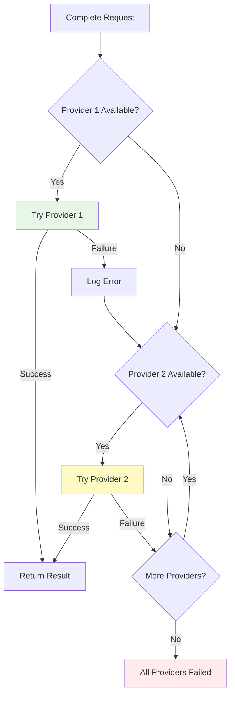

**Configuration Example:**
```typescript
const multiConfig: MultiLLMConfig = {
  providers: [
    {
      provider: 'anthropic',
      apiKey: 'sk-ant-...',
      model: 'claude-sonnet-4-20250514',
      endpoint: 'https://api.anthropic.com',
      maxTokens: 1500,
      temperature: 0.1,
      priority: 1,  // Try first
      enabled: true
    },
    {
      provider: 'azure-openai',
      apiKey: 'azure-key',
      model: 'gpt-4',
      endpoint: 'https://openai.azure.com',
      apiVersion: '2024-02-15-preview',
      maxTokens: 1500,
      temperature: 0.1,
      priority: 2,  // Fallback
      enabled: true
    }
  ],
  fallbackEnabled: true,
  maxRetries: 2,
  timeoutMs: 8000
};
```

### Content Scripts

#### Pega Detector (pega-detector.ts)

**Purpose**: Detect Pega Infinity applications with confidence scoring.

**Detection Signals:**
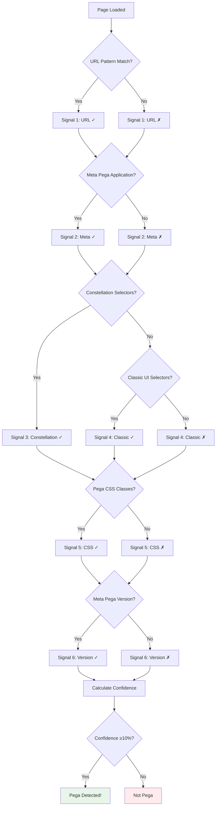

**Confidence Calculation:**
```
confidence = (fired_signals / total_signals)
min_confidence = 0.10 (10%)  # Lowered for URL-only detection
```

#### DOM Parser (dom-parser.ts)

**Purpose**: Extract semantic DOM representation with PII masking.

**Extraction Pipeline:**
```mermaid
graph TD
    A[Raw DOM] --> B[Extract Case Context]
    A --> C[Extract Fields]
    A --> D[Extract Actions]
    A --> E[Extract Page Metadata]
    
    C --> F{Has data-test-id?}
    F -->|Yes| G[Use Test ID Selector]
    F -->|No| H[Use aria-label/name/id]
    
    G --> I[Build Stable Selector]
    H --> I
    
    I --> J{Classify PII?}
    J -->|Yes| K[PII Masker.mask]
    J -->|No| L[Keep Value]
    
    K --> M[Token like {NAME_1}]
    L --> N[Original Value]
    
    M --> O[ParsedField]
    N --> O
    
    O --> P[DOMSnapshot]
    
    style K fill:#fff9c4
    style O fill:#e1f5ff
```

**Selector Priority:**
1. `data-test-id` (most stable)
2. `aria-label` with tag
3. Stable `id` (non-auto-generated)
4. `name` attribute
5. Semantic path (no positional selectors)

#### PII Masker (pii-masker.ts)

**Purpose**: Classify and tokenize PII before external transmission.

**PII Classification:**
```mermaid
graph TD
    A[Field Label/Test ID] --> B[Match PII Patterns]
    
    B --> C{Category Match?}
    C -->|NAME| D[Token: {NAME_1}]
    C -->|SSN| E[Token: {SSN_1}]
    C -->|DOB| F[Token: {DOB_1}]
    C -->|EMAIL| G[Token: {EMAIL_1}]
    C -->|PHONE| H[Token: {PHONE_1}]
    C -->|ACCOUNT| I[Token: {ACCOUNT_1}]
    C -->|ADDRESS| J[Token: {ADDRESS_1}]
    C -->|INCOME| K[Token: {INCOME_1}]
    C -->|None| L[Keep Original]
    
    D --> M[Store in Memory Map]
    E --> M
    F --> M
    G --> M
    H --> M
    I --> M
    J --> M
    K --> M
    L --> N[No Storage]
    
    M --> O[Return Token]
    N --> O
    
    style D fill:#ffebee
    style E fill:#ffebee
    style F fill:#ffebee
    style G fill:#ffebee
    style H fill:#fff9c4
    style I fill:#fff9c4
    style J fill:#fff9c4
    style K fill:#fff9c4
    style L fill:#e8f5e9
```

**Critical Security Properties:**
- ✅ Raw values NEVER transmitted externally
- ✅ Token map NEVER persisted (memory only)
- ✅ Tokens resolved ONLY in content script at execution time
- ✅ Map cleared on session/tab close

**Token Resolution:**
```typescript
// At execution time in content script:
const originalValue = piiMasker.resolve("{NAME_1}");  // "John Doe"
```

#### Action Executor (action-executor.ts)

**Purpose**: Execute validated action plans with PII de-tokenization.

**Enhanced Automation Features:**
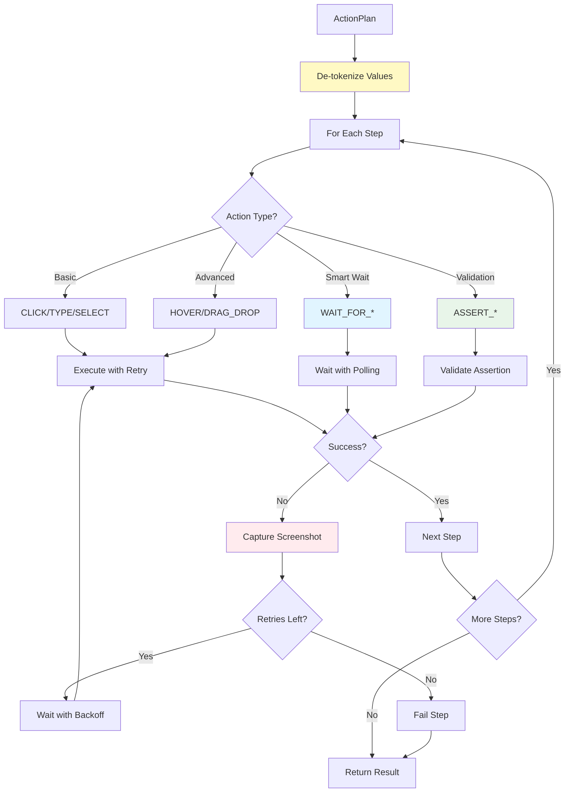

**Retry Configuration:**
```typescript
const DEFAULT_RETRY_CONFIG: RetryConfig = {
  maxRetries: 3,
  initialDelayMs: 500,
  maxDelayMs: 5000,
  backoffMultiplier: 2,
  screenshotOnFailure: true
};
```

### Side Panel (panel.ts)

**Purpose**: Chat-style UI for user interaction.

**UI States:**
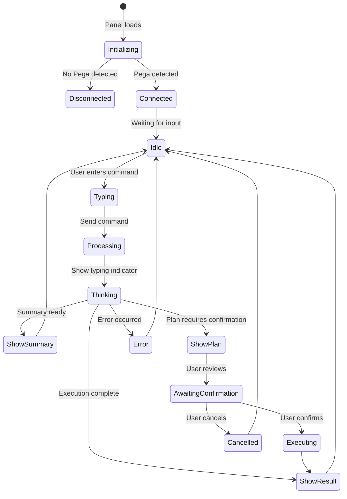

**Message Rendering:**
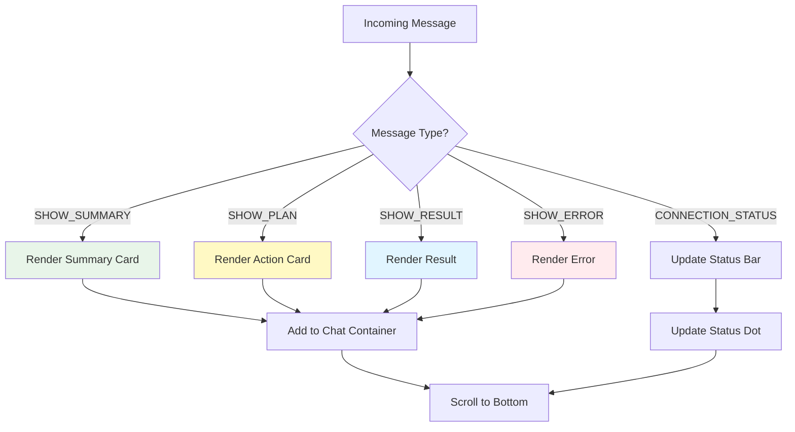

### Shared Utilities

#### Types (types.ts)

**Purpose**: Centralized TypeScript type definitions.

**Key Type Categories:**
- **Enums**: MessageType, UIFramework, PiiCategory, FieldType, ActionType, IntentType, OutcomeType
- **DOM Interfaces**: ParsedField, ParsedAction, CaseContext, DOMSnapshot
- **Plan Interfaces**: PlanStep, ActionPlan, ExecutionResult, StepResult
- **Session Interfaces**: SessionContext, CaseSummary, AuditEntry
- **Config Interfaces**: LLMConfig, SecurityConfig, PegaConfig, EnterpriseConfig
- **Error Classes**: PegaAgentError, LLMProviderError, PlanParseError, etc.

#### Message Types (message-types.ts)

**Purpose**: Type-safe message creation and validation.

**Message Envelope:**
```typescript
interface Message<T = unknown> {
  type: MessageType;        // Message type discriminator
  payload: T;               // Typed payload
  metadata: MessageMetadata; // Timestamp, sessionId, correlationId
}
```

**Message Creation:**
```typescript
const message = createMessage(MessageType.USER_COMMAND, {
  command: "Submit the case",
  tabId: 12345
}, {
  correlationId: generateCorrelationId()
});
```

---

## Message Passing Protocol

### Message Types and Routing

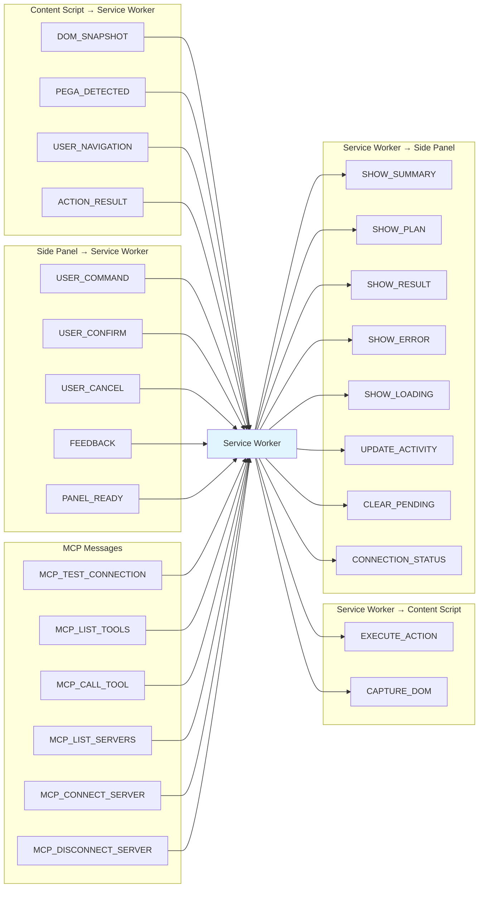

### Request/Response Patterns

**Async Request Pattern:**
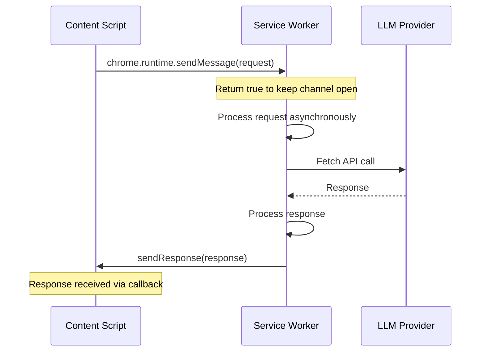

**Message Validation:**
```typescript
function isValidMessage(message: unknown): message is Message {
  if (!message || typeof message !== 'object') return false;
  const msg = message as Partial<Message>;
  if (!msg.type || !Object.values(MessageType).includes(msg.type)) {
    return false;
  }
  if (msg.payload === undefined) {
    return false;
  }
  return true;
}
```

### Correlation ID Tracking

**Purpose**: Match requests with responses across async operations.

**Implementation:**
```typescript
// Generate unique correlation ID
const correlationId = `${Date.now()}-${Math.random().toString(36).substring(2, 11)}`;

// Attach to request metadata
const message = createMessage(MessageType.USER_COMMAND, payload, {
  correlationId
});

// Track pending requests
const pendingRequests = new Map<string, PendingRequest>();
pendingRequests.set(correlationId, {
  timestamp: Date.now(),
  tabId: sender.tab?.id
});

// Cleanup on response
pendingRequests.delete(correlationId);
```

---

## Security Architecture

### Trust Boundaries

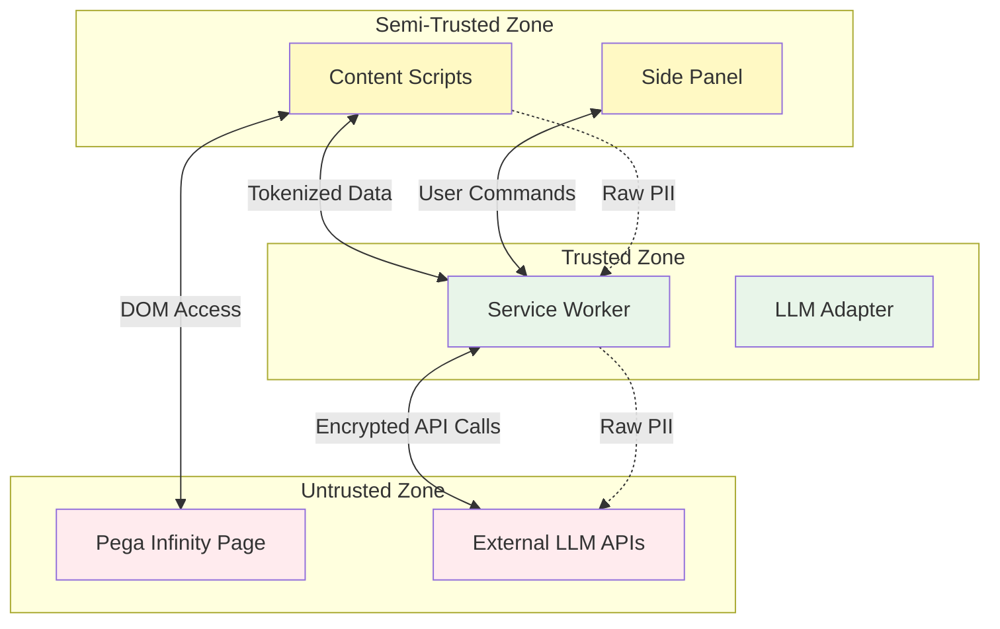

**Trust Rules:**
1. **Service Worker**: ONLY component that can call external APIs
2. **Content Scripts**: Can read DOM but MUST mask PII before sending
3. **Side Panel**: UI only, no direct DOM access
4. **External APIs**: Never receive raw PII

### PII Masking Flow

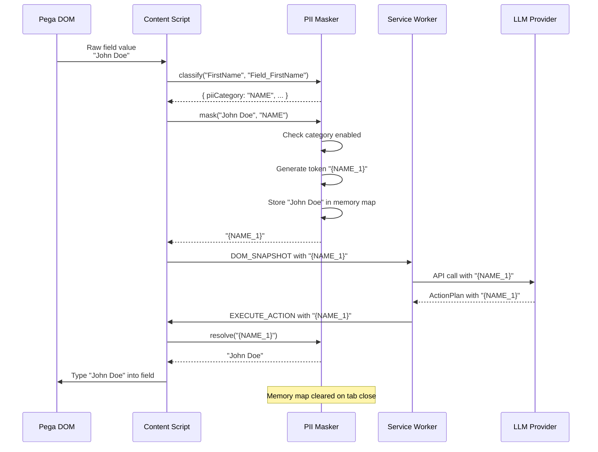

**PII Categories:**
- **NAME**: First name, last name, full name
- **SSN**: Social security number, tax ID, national ID
- **DOB**: Date of birth, birth date
- **EMAIL**: Email addresses
- **PHONE**: Phone numbers, mobile, fax
- **ACCOUNT**: Account numbers, card numbers, policy numbers
- **ADDRESS**: Street addresses, city, state, zip
- **INCOME**: Salary, wages, financial amounts

**Configuration:**
```typescript
const securityConfig: SecurityConfig = {
  piiMaskingEnabled: true,
  piiCategoriesToMask: ['NAME', 'SSN', 'DOB', 'EMAIL', 'PHONE', 'ACCOUNT', 'ADDRESS', 'INCOME'],
  localProcessingOnly: false,
  allowedLLMProviders: ['anthropic', 'azure-openai'],
  auditLoggingEnabled: true,
  requireConfirmationForAllActions: false,
  disabledCapabilities: []
};
```

### Tokenization Strategy

**Token Format:** `{CATEGORY_NUMBER}`

**Examples:**
- `{NAME_1}` → "John Doe"
- `{SSN_1}` → "123-45-6789"
- `{EMAIL_1}` → "john.doe@example.com"
- `{ACCOUNT_1}` → "CC-4111-1111-1111-1111"

**Deduplication:**
```typescript
// Same value gets same token
mask("John Doe", "NAME")  // → "{NAME_1}"
mask("John Doe", "NAME")  // → "{NAME_1}" (deduplicated)

// Different values get different tokens
mask("Jane Smith", "NAME")  // → "{NAME_2}"
```

**Memory Map Structure:**
```typescript
Map<string, Map<string, string>> {
  "NAME": Map {
    "{NAME_1}": "John Doe",
    "{NAME_2}": "Jane Smith"
  },
  "SSN": Map {
    "{SSN_1}": "123-45-6789"
  }
}
```

**Security Guarantees:**
- ✅ Memory map NEVER persisted to disk
- ✅ Tokens ONLY resolved in content script
- ✅ Map cleared on `unload` event
- ✅ Map cleared on configuration change
- ✅ No API to retrieve raw values from memory

---

## State Management

### Session Store Architecture

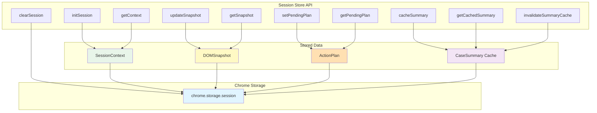

**Storage Keys:**
```typescript
// Per-tab namespacing
const keys = {
  context: `session:${tabId}:context`,
  snapshot: `session:${tabId}:snapshot`,
  pendingPlan: `session:${tabId}:pendingPlan`,
  summaryCache: `session:${tabId}:summaryCache`
};
```

**Lifecycle:**
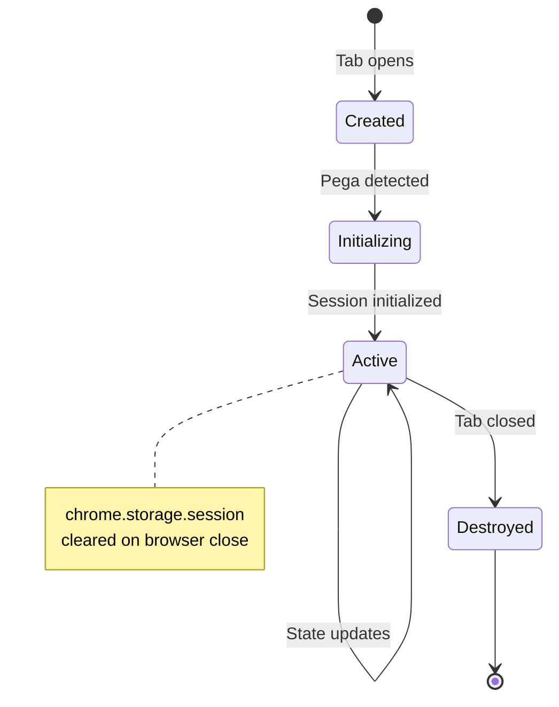

### Cache Invalidation

**Summary Cache Strategy:**
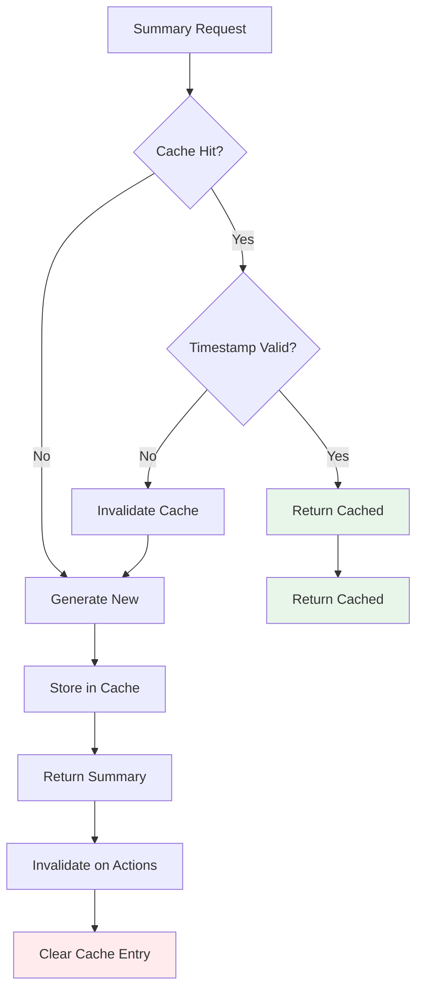

**Invalidation Triggers:**
1. Action execution completes
2. DOM snapshot changes significantly
3. Manual cache clear request
4. Configuration change

**Cache Key Format:**
```typescript
`${caseId}:${snapshotHash}`
```

### Cross-Tab Isolation

```mermaid
graph LR
    subgraph "Tab 1"
        T1S[Session 1]
        T1D[Data 1]
    end
    
    subgraph "Tab 2"
        T2S[Session 2]
        T2D[Data 2]
    end
    
    subgraph "Shared Storage"
        SS[chrome.storage.session]
    end
    
    T1S <-->|Key: session:1:*| SS
    T2S <-->|Key: session:2:*| SS
    
    T1D -.->|No Access| T2D
    T2D -.->|No Access| T1D
    
    style T1S fill:#e8f5e9
    style T2S fill:#fff9c4
    style SS fill:#e1f5ff
```

**Isolation Guarantees:**
- ✅ Each tab has unique `tabId`
- ✅ All storage keys namespaced by `tabId`
- ✅ No cross-tab data leakage
- ✅ Tab cleanup on `chrome.tabs.onRemoved`

---

## MCP Server

### Protocol Implementation

**Model Context Protocol (MCP)** - Standard for AI tool integration.

```mermaid
graph TD
    subgraph "MCP Server"
        S[Server]
        T[Tools]
        R[Resources]
        P[Prompts]
    end
    
    subgraph "MCP Clients"
        C1[Claude Desktop]
        C2[Cursor IDE]
        C3[Custom Client]
    end
    
    subgraph "Pega Extension"
        E[Service Worker]
        CS[Content Scripts]
    end
    
    C1 <-->|JSON-RPC 2.0| S
    C2 <-->|JSON-RPC 2.0| S
    C3 <-->|JSON-RPC 2.0| S
    
    S <-->|Tool Calls| E
    S <-->|Resource Access| E
    S <-->|Prompt Templates| E
    
    E <-->|DOM Commands| CS
    
    style S fill:#e1f5ff
    style E fill:#fff9c4
    style CS fill:#e8f5e9
```

**JSON-RPC Message Format:**
```typescript
// Request
{
  "jsonrpc": "2.0",
  "id": 1,
  "method": "tools/call",
  "params": {
    "name": "pega_get_case_summary",
    "arguments": {
      "includePII": false
    }
  }
}

// Response
{
  "jsonrpc": "2.0",
  "id": 1,
  "result": {
    "content": [
      {
        "type": "text",
        "text": "{...summary data...}"
      }
    ]
  }
}
```

### Tool and Resource Handlers

**Available Tools:**
```mermaid
graph TD
    A[MCP Tools] --> B[pega_get_case_summary]
    A --> C[pega_execute_action_plan]
    A --> D[pega_get_dom_snapshot]
    A --> E[pega_detect_framework]
    A --> F[pega_update_field]
    A --> G[pega_click_action]
    A --> H[pega_navigate_case]
    A --> I[pega_wait_for]
    
    B --> J[Generate Summary]
    C --> K[Execute Actions]
    D --> L[Capture DOM]
    E --> M[Detect Pega]
    F --> N[Update Field]
    G --> O[Click Button]
    H --> P[Navigate]
    I --> Q[Wait Condition]
    
    style A fill:#e1f5ff
    style J fill:#e8f5e9
    style K fill:#fff9c4
```

**Available Resources:**
```mermaid
graph LR
    A[MCP Resources] --> B[pega://current-case]
    A --> C[pega://case-history]
    A --> D[pega://available-actions]
    
    B --> E[Current Case Data]
    C --> F[Audit Log]
    D --> G[Action Buttons]
    
    style A fill:#e1f5ff
    style E fill:#e8f5e9
    style F fill:#fff9c4
    style G fill:#ffe0b2
```

### Client Connection Management

**Connection Lifecycle:**
```mermaid
stateDiagram-v2
    [*] --> Listening: chrome.runtime.onConnectExternal
    Listening --> Connected: Client connects
    Connected --> Initialized: initialize handshake
    Initialized --> Ready: Capabilities exchanged
    
    Ready --> Ready: Processing requests
    
    Ready --> Disconnected: Client disconnects
    Disconnected --> [*]
    
    note right of Ready
        Registered handlers:
        - tools/list
        - tools/call
        - resources/list
        - resources/read
        - prompts/list
        - prompts/get
    end note
```

**Multi-Client Support:**
```typescript
class MCPServer {
  private clients = new Map<string, MCPClientConnection>()
  
  addClient(clientId: string, port?: chrome.runtime.Port): void {
    this.clients.set(clientId, {
      id: clientId,
      port: port ?? null,
      capabilities: {}
    });
  }
  
  removeClient(clientId: string): void {
    this.clients.delete(clientId)
  }
  
  broadcastNotification(method: string, params?: Record<string, unknown>): void {
    for (const [_clientId, client] of this.clients) {
      if (client.port) {
        client.port.postMessage({ jsonrpc: '2.0', method, params });
      }
    }
  }
}
```

---

## Technology Choices

### Why TypeScript

**Type Safety:**
```typescript
// Catch errors at compile time
interface ActionPlan {
  planId: string;
  intent: IntentType;
  steps: PlanStep[];
  // ... more fields
}

// Type-safe message passing
function handleMessage(message: Message<UserCommandPayload>) {
  // payload is properly typed
  const command = message.payload.command;  // string
}
```

**Benefits:**
- ✅ Eliminates entire classes of runtime errors
- ✅ Excellent IDE support (autocomplete, refactoring)
- ✅ Self-documenting code
- ✅ Easier maintenance for large codebases

**No `any` Types Rule:**
```typescript
// ❌ Bad
function processData(data: any) { ... }

// ✅ Good
function processData(data: DOMSnapshot) { ... }
```

### Why Manifest V3

**Security Improvements over V2:**
```mermaid
graph TD
    subgraph "Manifest V2"
        V2B[Background Pages]
        V2R[Remote Code]
        V2P[Persistent State]
    end
    
    subgraph "Manifest V3"
        V3S[Service Workers]
        V3A[Content Security Policy]
        V3E[Action Handlers]
    end
    
    V2B -.->|Deprecated| V3S
    V2R -.->|Blocked| V3A
    V2P -.->|Ephemeral| V3E
    
    style V3S fill:#e8f5e9
    style V3A fill:#e8f5e9
    style V3E fill:#e8f5e9
```

**Key Features:**
- **Service Workers**: Event-driven, non-persistent background scripts
- **CSP Level 3**: Stricter content security policies
- **Action Handlers**: Declarative user action handling
- **Host Permissions**: Granular permission model

**Migration Benefits:**
- ✅ Better performance (no persistent background page)
- ✅ Enhanced security (CSP restrictions)
- ✅ Future-proof (Chrome requirement)
- ✅ Cross-browser compatibility

### LLM Provider Abstraction

**Provider Interface:**
```typescript
interface ProviderConfig {
  url: (config: LLMConfig) => string;
  headers: (config: LLMConfig) => Record<string, string>;
  body: (config: LLMConfig, systemPrompt: string, userPrompt: string) => unknown;
  parseResponse: (data: unknown) => { content: string; tokensUsed: number };
}
```

**Supported Providers:**
```mermaid
graph TD
    A[LLM Adapter] --> B[Anthropic Claude]
    A --> C[Azure OpenAI]
    A --> D[OpenAI GPT]
    A --> E[Google Gemini]
    A --> F[Mistral]
    A --> G[Local Endpoints]
    
    B --> H[Provider Config]
    C --> H
    D --> H
    E --> H
    F --> H
    G --> H
    
    H --> I[Unified Interface]
    
    style A fill:#e1f5ff
    style I fill:#e8f5e9
```

**Benefits:**
- ✅ **Vendor Independence**: Switch providers without code changes
- ✅ **Automatic Fallback**: Try backup providers on failure
- ✅ **Cost Optimization**: Route requests by priority/cost
- ✅ **Hybrid Deployment**: Mix cloud and local models
- ✅ **Compliance**: Meet data residency requirements

**Configuration Example:**
```typescript
// Multi-provider with fallback
const config: MultiLLMConfig = {
  providers: [
    {
      provider: 'anthropic',
      priority: 1,  // Try first
      enabled: true
    },
    {
      provider: 'azure-openai',
      priority: 2,  // Fallback
      enabled: true
    }
  ],
  fallbackEnabled: true,
  maxRetries: 2
};
```

---

## Appendix

### Mermaid Diagram Syntax Reference

**Quick Reference:**
- `graph TD`: Top-down diagram
- `graph LR`: Left-right diagram
- `sequenceDiagram`: Sequence diagram
- `stateDiagram-v2`: State diagram
- `subgraph`: Group related nodes
- `style`: Apply colors/styles

### Type Definitions

**Core Types Location:** `/src/shared/types.ts`

**Message Types Location:** `/src/shared/message-types.ts`

**MCP Types Location:** `/src/shared/mcp-types.ts`

### Configuration Files

**Manifest:** `/manifest.json` - Extension configuration

**Package:** `/package.json` - Dependencies and scripts

**TypeScript:** `/tsconfig.json` - Compiler configuration

**Webpack:** `/webpack.config.js` - Build configuration

---

## Related Documentation

- [Developer Guide](/docs/developer-guide.md)
- [API Documentation](/docs/api.md)
- [Security Documentation](/docs/security.md)
- [Migration Guide](/docs/migration.md)

---

*Last Updated: 2026-05-10*
*Version: 1.0.0*
